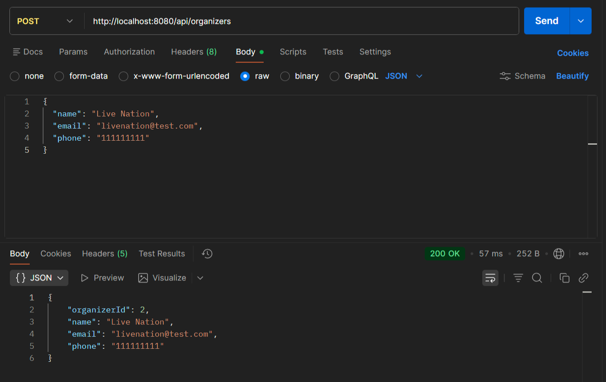
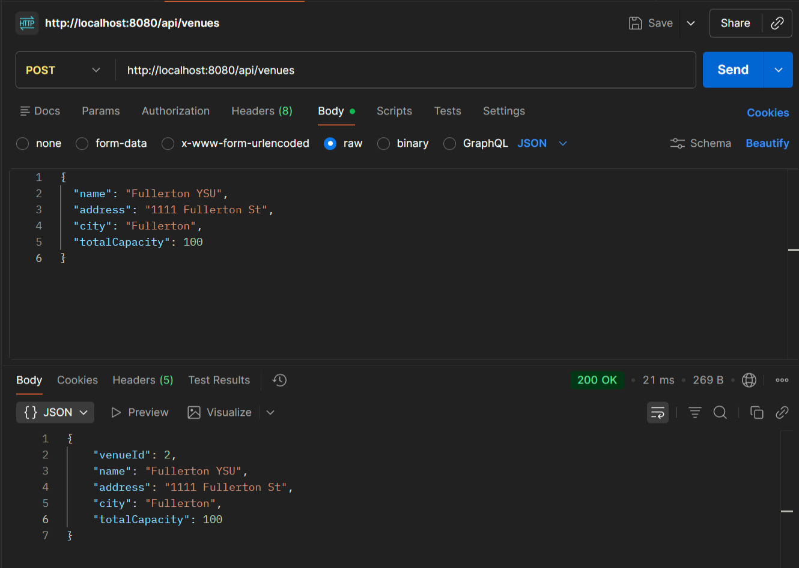
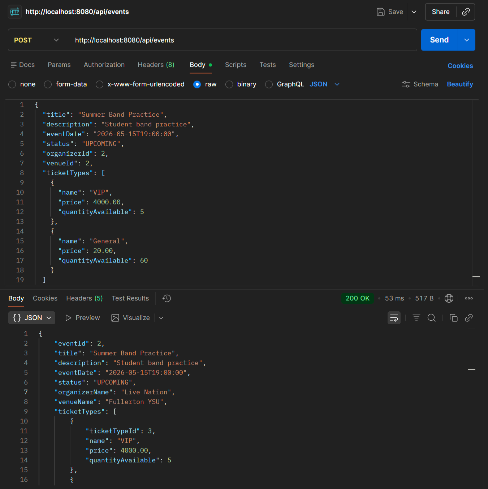
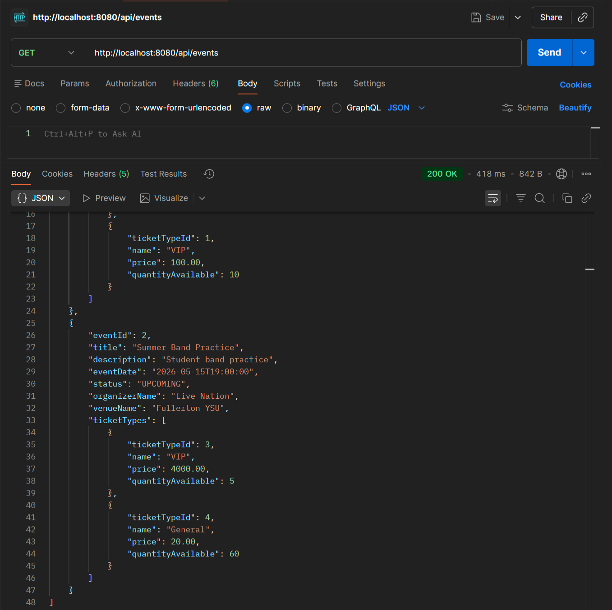
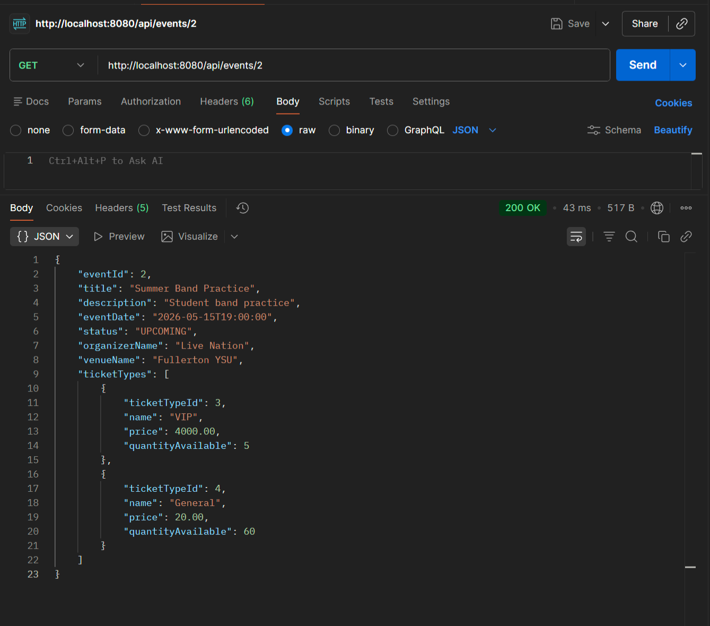
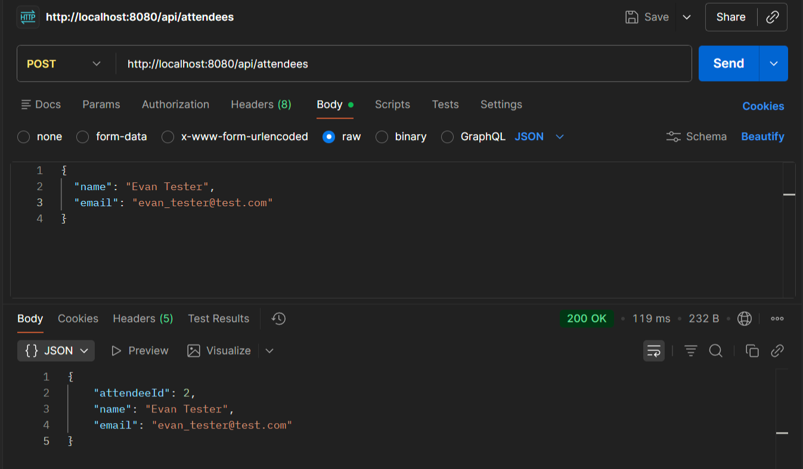
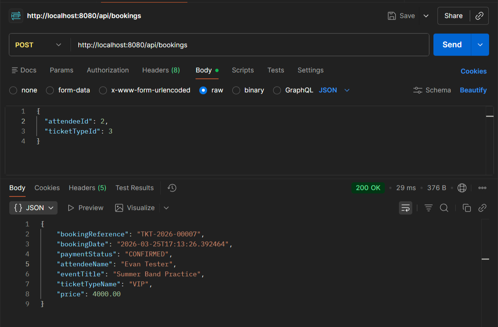
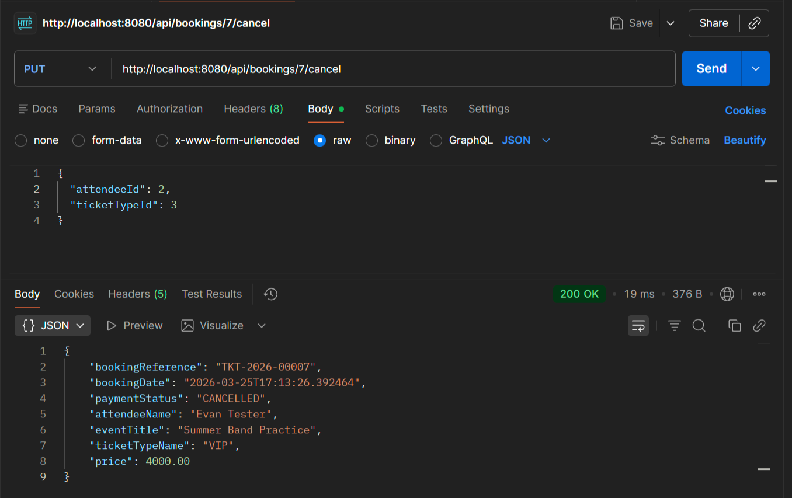
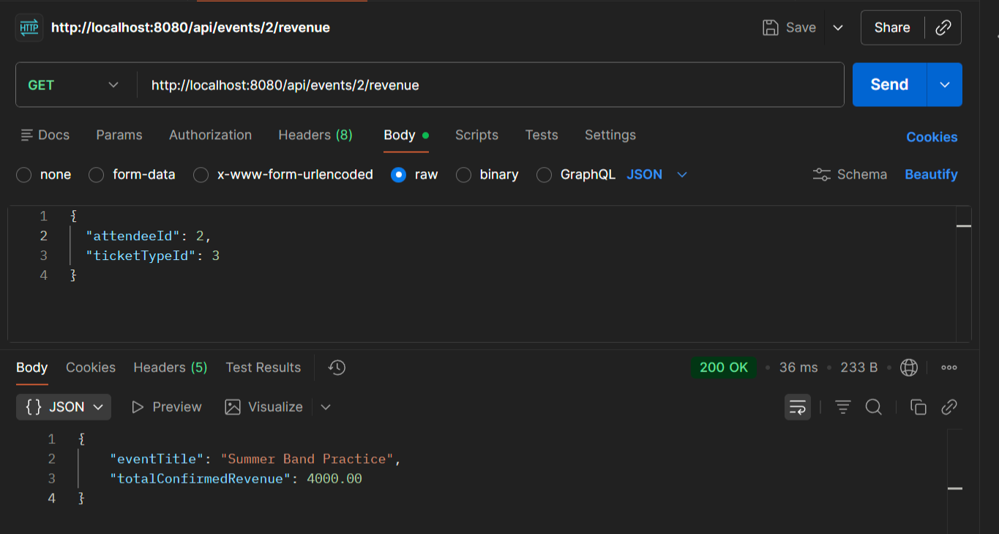
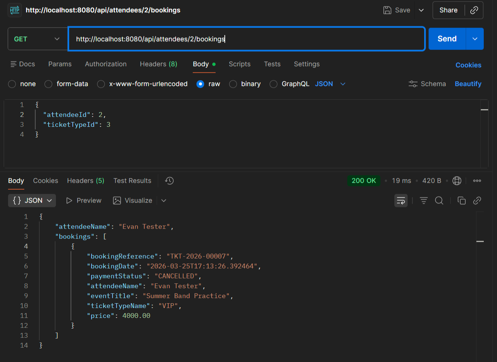

# CPSC-449 Midterm Project
## Evan Wenzel
### CWID: 888971421

This project is the building of a backend API Evennt Ticketing System for a a event ticket distributer. Utilizing Spring Boot, JPA entity relationships, DTO patterns, I developed a useable backend system that takes in user information and applies logic to manipulate the data to fit within the database. Backend systems are implemented to manipulate events, venues, organizers, individuals, and ticket information.

## Youtube Showcase
###

## Functional Endpoints
### POST /api/organizers

### POST /api/venues

### POST /api/events

### GET /api/events

### GET /api/events{id}

### POST /api/attendees

### POST /api/bookings

### PUT /api/bookings/{id}/cancel

### GET /api/events/{id}/revenue

### GET /api/attendees/{id}/bookings
